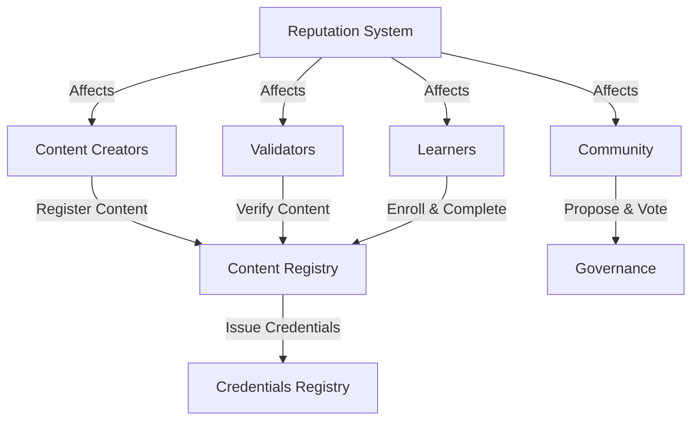

# CoreLoop: Decentralized Education Platform

A decentralized ecosystem for education enabling direct interaction between content creators, validators, and learners. CoreLoop ensures quality through community governance while maintaining accessibility and standards through distributed consensus mechanisms.

## Overview

CoreLoop revolutionizes educational content delivery by:
- Enabling peer-to-peer educational content creation and consumption
- Implementing reputation-based quality control
- Providing verifiable credentials through blockchain
- Creating incentive structures for all participants
- Maintaining quality through decentralized governance

## Architecture

The platform is built around a core smart contract that manages all essential functions of the educational ecosystem.



### Core Components
- **User Management**: Role-based system (Admin, Content Creator, Validator, Learner)
- **Content Registry**: Stores educational content metadata and verification status
- **Enrollment System**: Tracks learner progress and course completion
- **Credential System**: Issues and verifies educational achievements
- **Governance System**: Enables community-driven decision making
- **Reputation System**: Incentivizes quality contributions and participation

## Contract Documentation

### Core Education Platform Contract

The main contract (`core-education-platform.clar`) implements the following key functionalities:

#### User Management
- Role-based access control
- Reputation tracking
- User registration and management

#### Content Management
- Content registration by creators
- Content verification by validators
- Content metadata updates
- Enrollment tracking

#### Credential System
- Course completion tracking
- Credential issuance
- Verification history

#### Governance
- Proposal creation
- Voting mechanics
- Proposal finalization
- Reputation-based voting weight

## Getting Started

### Prerequisites
- Clarinet CLI installed
- Stacks wallet for blockchain interactions

### Basic Usage

1. **Register as a Content Creator**
```clarity
(contract-call? .core-education-platform register-user 
    'ST1PQHQKV0RJXZFY1DGX8MNSNYVE3VGZJSRTPGZGM 
    (list u2))
```

2. **Register Educational Content**
```clarity
(contract-call? .core-education-platform register-content 
    "Introduction to Blockchain"
    "A comprehensive course on blockchain fundamentals"
    0x... ;; content hash
    "Technology"
    u100)
```

3. **Verify Content (Validators)**
```clarity
(contract-call? .core-education-platform verify-content 
    u1 ;; content-id
    u2 ;; STATUS-VERIFIED
    "Excellent course material")
```

4. **Enroll in Course (Learners)**
```clarity
(contract-call? .core-education-platform enroll-in-course u1)
```

## Function Reference

### Content Creation
- `register-content`: Register new educational content
- `update-content`: Update existing content metadata

### Verification
- `verify-content`: Submit content verification
- `get-verification`: View verification history

### Learning
- `enroll-in-course`: Enroll in educational content
- `complete-course`: Mark course as completed
- `issue-credential`: Issue completion credential

### Governance
- `create-proposal`: Create new governance proposal
- `vote-on-proposal`: Cast vote on proposal
- `finalize-proposal`: Complete proposal voting period

## Development

### Testing
Run the test suite using Clarinet:
```bash
clarinet test
```

### Local Development
1. Start Clarinet console:
```bash
clarinet console
```

2. Deploy contracts:
```bash
clarinet deploy
```

## Security Considerations

### Access Control
- Role-based permissions enforce appropriate access
- Reputation requirements for critical actions
- Admin controls for system maintenance

### Known Limitations
- Verification requires minimum reputation
- Governance proposals require reputation threshold
- Vote weight tied to reputation score

### Best Practices
- Verify user roles before interactions
- Check content verification status before enrollment
- Ensure proper credential validation
- Monitor reputation scores for malicious activity